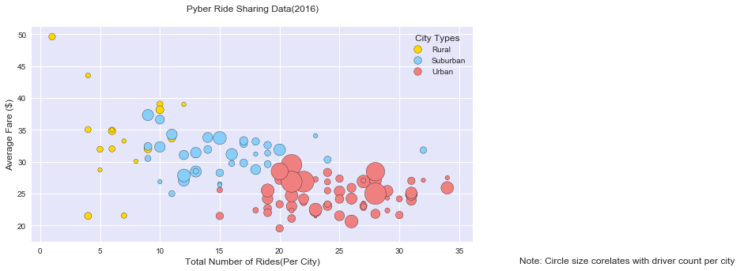
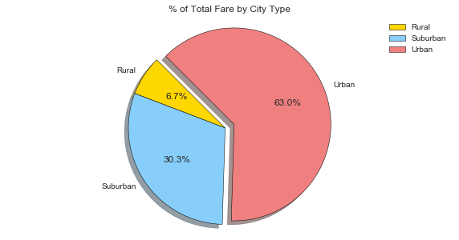
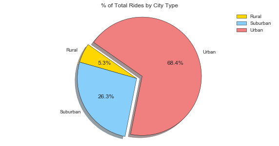
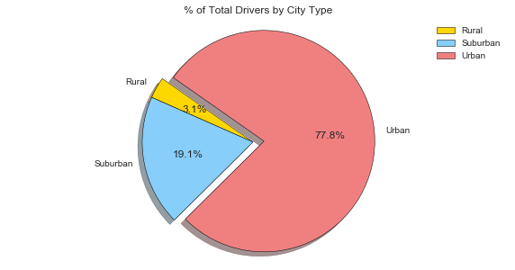

# Pyber

# Observations:
    
    
1) From the Bubble chart we can observe that even though the total number of rides are more in Urban areas still the avg fare per city is less compare to that of Rural and Suburban
2) Total number of drivers and directly proportional to the number of rides. More Rides = More Drivers
3) Urban cities are clearly contributing towards more rides and more total fare.
4) Even though 36-37% of Total fare is coimng from Rural and Suburban but total number of drivers in these areas are only 22%. There is opportunity for more business in those areas.


```python
import pandas as pd
import numpy as np
import matplotlib.pyplot as plt
import seaborn as sns
```


```python
#Reading data in df from csv

City = pd.read_csv("city_data.csv")
Ride = pd.read_csv("ride_data.csv")
```


```python
#Removing dulpilcates city from City_df Total rows= 125
city_df = City.groupby(['city','type'] ,as_index = False)['driver_count'].sum()
```


```python
# View is dataframe made by merging the two raw tables City_data and Ride_data

view = pd.merge(city_df, Ride, how = 'inner', on = 'city')
view.head(5)
```


<div>
<style>
    .dataframe thead tr:only-child th {
        text-align: right;
    }

    .dataframe thead th {
        text-align: left;
    }

    .dataframe tbody tr th {
        vertical-align: top;
    }
</style>
<table border="1" class="dataframe">
  <thead>
    <tr style="text-align: right;">
      <th></th>
      <th>city</th>
      <th>type</th>
      <th>driver_count</th>
      <th>date</th>
      <th>fare</th>
      <th>ride_id</th>
    </tr>
  </thead>
  <tbody>
    <tr>
      <th>0</th>
      <td>Alvarezhaven</td>
      <td>Urban</td>
      <td>21</td>
      <td>2016-04-18 20:51:29</td>
      <td>31.93</td>
      <td>4267015736324</td>
    </tr>
    <tr>
      <th>1</th>
      <td>Alvarezhaven</td>
      <td>Urban</td>
      <td>21</td>
      <td>2016-08-01 00:39:48</td>
      <td>6.42</td>
      <td>8394540350728</td>
    </tr>
    <tr>
      <th>2</th>
      <td>Alvarezhaven</td>
      <td>Urban</td>
      <td>21</td>
      <td>2016-09-01 22:57:12</td>
      <td>18.09</td>
      <td>1197329964911</td>
    </tr>
    <tr>
      <th>3</th>
      <td>Alvarezhaven</td>
      <td>Urban</td>
      <td>21</td>
      <td>2016-08-18 07:12:06</td>
      <td>20.74</td>
      <td>357421158941</td>
    </tr>
    <tr>
      <th>4</th>
      <td>Alvarezhaven</td>
      <td>Urban</td>
      <td>21</td>
      <td>2016-04-04 23:45:50</td>
      <td>14.25</td>
      <td>6431434271355</td>
    </tr>
  </tbody>
</table>
</div>


```python
# Creating object for total Rides 
Total_ride = view.groupby(['city','type']).count()["ride_id"]
TD = Total_ride.to_frame().reset_index()
```


```python
# Creating object for average fare
avg_fare = view.groupby(['city','type']).mean()["fare"]
AF = avg_fare.to_frame().reset_index()
```


```python
# Creating object for total Drivers
Total_Drivers = view.groupby(['type','city']).mean()["driver_count"].groupby('city').sum()
Drivers = Total_Drivers.to_frame().reset_index()
```


```python
# Joing 2 dataframes Total Rides and Avg /fare 
Table = pd.merge(TD,AF, on = ['city','type'])
SortedTable = Table.sort_values('type')
```


```python
# Joing 3rd dataframe into above joined table 
Agg_Table = pd.merge(SortedTable,Drivers, on = 'city')
#Agg_Table.head(5)
```


```python
#Asthetics and Colors

City_type = view['type'].unique()
City_type.sort()
label = City_type
colors = ["gold", "lightskyBlue", "lightcoral"]
explode = (0, 0, 0.05)
```


```python
# Create data
fig = plt.figure(figsize=(10,5))
ax = fig.add_subplot(1, 1, 1,facecolor='lavender')

g1 = (Agg_Table.loc[(Agg_Table['type'] == 'Rural'),['ride_id']], Agg_Table.loc[(Agg_Table['type'] == 'Rural'),['fare']])
g2 = (Agg_Table.loc[(Agg_Table['type'] == 'Suburban'),['ride_id']], Agg_Table.loc[(Agg_Table['type'] == 'Suburban'),['fare']])
g3 = (Agg_Table.loc[(Agg_Table['type'] == 'Urban'),['ride_id']], Agg_Table.loc[(Agg_Table['type'] == 'Urban'),['fare']])


 
data = (g1, g2,g3)
groups = City_type

# Create plot 
for data, color, group in zip(data, colors, groups):
    x, y= data
    ax.scatter(x, y, 
               alpha=1.0, 
               c=color, 
               edgecolors='black', 
               s=Agg_Table['driver_count']*10, 
               label=group)

plt.title('Pyber Ride Sharing Data(2016)',y=1.05, fontsize = 12.0)
plt.xlabel('Total Number of Rides(Per City)',fontsize = 12.0)
plt.ylabel('Average Fare ($)',fontsize = 12.0)
plt.legend(title = "City Types", loc=1, markerscale = 0.5, fontsize = 10.0)
plt.text(40,15,"Note: Circle size corelates with driver count per city", va = 'top',ha = 'left',fontsize=12.0)
sns.set_style('darkgrid')
plt.savefig("bubbleplot.png")
plt.show()
```





```python
# Total Fare by city Type
fig = plt.figure(figsize=(10,5))
ax = fig.add_subplot(111)

Total_fare = view.groupby(['type']).sum()['fare']

pie_wedge_collection = ax.pie(Total_fare.sort_index(), 
                              explode = explode ,
                              labels = label, 
                              colors=colors,
                              autopct="%1.1f%%", 
                              shadow=True, 
                              wedgeprops = {'linewidth': 0.5},
                              startangle=135,
                              radius = 0.5)

for x in pie_wedge_collection[0]:
    x.set_edgecolor('black')

    
    
ax.axis("equal")    
ax.set_title("% of Total Fare by City Type",fontsize = 12.0)
plt.legend(label, loc=1,fontsize = 10.0)
plt.savefig("% of Total Fare.png")
plt.show()
```





```python
# Total Rides by city Type

fig = plt.figure(figsize=(10,5))
ax = fig.add_subplot(111)

Total_Ride = view.groupby(['type']).count()['ride_id']

pie_wedge_collection = ax.pie(Total_Ride, 
                              explode = explode ,
                              labels = label, 
                              colors=colors,
                              autopct="%1.1f%%", 
                              wedgeprops = {'linewidth': 0.5},
                              shadow=True, 
                              startangle=145,
                             radius = 0.5)

for x in pie_wedge_collection[0]:
    x.set_edgecolor('black')

ax.set_title("% of Total Rides by City Type",fontsize = 12.0)
plt.legend(label, loc="best",fontsize = 10.0)
ax.axis("equal")
plt.savefig("% of Total Rides.png")
plt.show()
```





```python
#% of Total Driver by City 

fig = plt.figure(figsize=(10,5))
ax = fig.add_subplot(111)

Total_Drivers = view.groupby(['type','city']).mean()["driver_count"].groupby('type').sum()

pie_wedge_collection = ax.pie(Total_Drivers.sort_index(), 
                              explode = explode ,
                              labels = label, 
                              colors=colors,
                              autopct="%1.1f%%", 
                              wedgeprops = {'linewidth': 0.5},
                              shadow=True, 
                              startangle=145,
                             radius = 0.5)

for x in pie_wedge_collection[0]:
    x.set_edgecolor('black')

ax.set_title("% of Total Drivers by City Type",fontsize = 12.0)
plt.legend(label, loc="best",fontsize = 10.0)
ax.axis("equal")
plt.savefig("% of Total Drivers.png")
plt.show()
```





```python

```


```python

```
